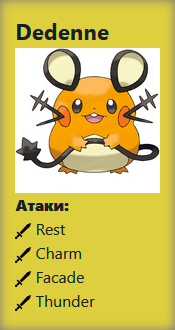
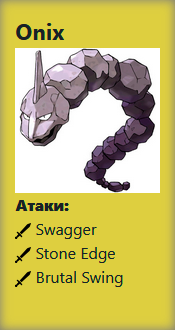
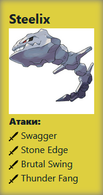
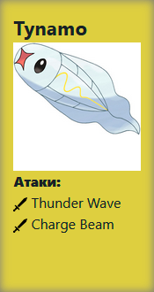
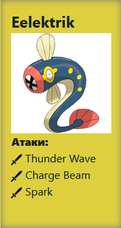
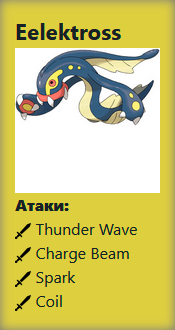
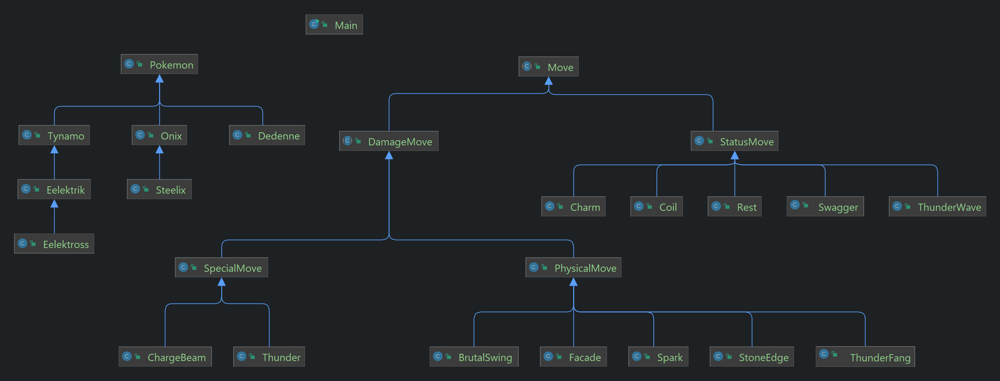

# Отчёт по лабораторной работе

### 1. Текст задания:
На основе базового класса Pokemon написать свои классы для заданных видов покемонов. Каждый вид покемона должен иметь один или два типа и стандартные базовые характеристики:

    очки здоровья (HP)
    атака (attack)
    защита (defense)
    специальная атака (special attack)
    специальная защита (special defense)
    скорость (speed)

Классы покемонов должны наследоваться в соответствии с цепочкой эволюции покемонов. На основе базовых классов PhysicalMove, SpecialMove и StatusMove реализовать свои классы для заданных видов атак.

Атака должна иметь стандартные тип, силу (power) и точность (accuracy). Должны быть реализованы стандартные эффекты атаки. Назначить каждому виду покемонов атаки в соответствии с вариантом. Уровень покемона выбирается минимально необходимым для всех реализованных атак.

Используя класс симуляции боя Battle, создать 2 команды покемонов (каждый покемон должен иметь имя) и запустить бой.


___

### 2. Диаграмма классов реализованной объектной модели.


___

### 3. Исходный код программы:

https://github.com/SikioN/lab_02
___

### 4. Результат работы программы:
```
Dedenne Деденне из команды белых вступает в бой!
Tynamo Тинамо из команды желтых вступает в бой!
Dedenne Деденне промахивается

Tynamo Тинамо применяет Thunder Wave🌠. 
Dedenne Деденне парализован

Dedenne Деденне применяет Thunder⛈. 
Tynamo Тинамо теряет 32 здоровья.

Tynamo Тинамо борется с соперником. 
Dedenne Деденне теряет 5 здоровья.
Tynamo Тинамо теряет 1 здоровья.

Dedenne Деденне применяет Thunder⛈. 
Tynamo Тинамо теряет 45 здоровья.
Tynamo Тинамо теряет сознание.
Eelektrik Илектрик из команды желтых вступает в бой!
Dedenne Деденне применяет Charm💫. 
Eelektrik Илектрик уменьшает атаку.

Eelektrik Илектрик применяет Spark👻. 
Dedenne Деденне восстанавливает 1 здоровья.

Dedenne Деденне применяет Charm💫. 
Eelektrik Илектрик уменьшает атаку.

Eelektrik Илектрик применяет Charge Beam⚡. 
Dedenne Деденне теряет 7 здоровья.

Dedenne Деденне применяет Facade👻. 
Eelektrik Илектрик теряет 19 здоровья.

Eelektrik Илектрик применяет Charge Beam⚡. 
Dedenne Деденне теряет 9 здоровья.

Dedenne Деденне промахивается

Eelektrik Илектрик применяет Spark👻. 
Dedenne Деденне восстанавливает 3 здоровья.

Dedenne Деденне применяет Facade👻. 
Eelektrik Илектрик теряет 12 здоровья.

Eelektrik Илектрик борется с соперником. 
Dedenne Деденне восстанавливает 2 здоровья.

Dedenne Деденне применяет Thunder⛈. 
Eelektrik Илектрик теряет 19 здоровья.
Eelektrik Илектрик парализован

Eelektrik Илектрик применяет Spark👻. 
Dedenne Деденне восстанавливает 4 здоровья.

Dedenne Деденне промахивается

Eelektrik Илектрик применяет Charge Beam⚡. 
Dedenne Деденне теряет 9 здоровья.

Dedenne Деденне применяет Facade👻. 
Eelektrik Илектрик теряет 19 здоровья.

Eelektrik Илектрик применяет Spark👻. 
Dedenne Деденне восстанавливает 3 здоровья.

Dedenne Деденне промахивается

Eelektrik Илектрик применяет Spark👻. 
Критический удар!
Dedenne Деденне восстанавливает 5 здоровья.

Dedenne Деденне применяет Facade👻. 
Eelektrik Илектрик теряет 17 здоровья.
Eelektrik Илектрик теряет сознание.
Eelektross Илектросс из команды желтых вступает в бой!
Dedenne Деденне применяет Thunder⛈. 
Eelektross Илектросс теряет 26 здоровья.

Eelektross Илектросс промахивается

Dedenne Деденне применяет Facade👻. 
Eelektross Илектросс теряет 15 здоровья.

Eelektross Илектросс промахивается

Dedenne Деденне промахивается

Eelektross Илектросс промахивается

Dedenne Деденне применяет Facade👻. 
Eelektross Илектросс теряет 17 здоровья.

Eelektross Илектросс применяет Thunder Wave🌠. 

Dedenne Деденне промахивается

Eelektross Илектросс применяет Charge Beam⚡. 
Dedenne Деденне теряет 7 здоровья.

Dedenne Деденне применяет Facade👻. 
Критический удар!
Eelektross Илектросс теряет 39 здоровья.
Eelektross Илектросс теряет сознание.
В команде желтых не осталось покемонов.
Команда белых побеждает в этом бою!
```
___

### 5. Выводы по работе:
В процессе выполнения лабораторной работы я изучил особенности языка программирования Java:

- Применение базовых понятий ООП,
- Ознакомился с документацией,
- Ознакомился с понятием видимости переменых,
- Использовал распределение по пакетам, 
- Научился подключать внешние библиотеки. 

Полученные знания будут использоваться для дальнейшего изучения языка.